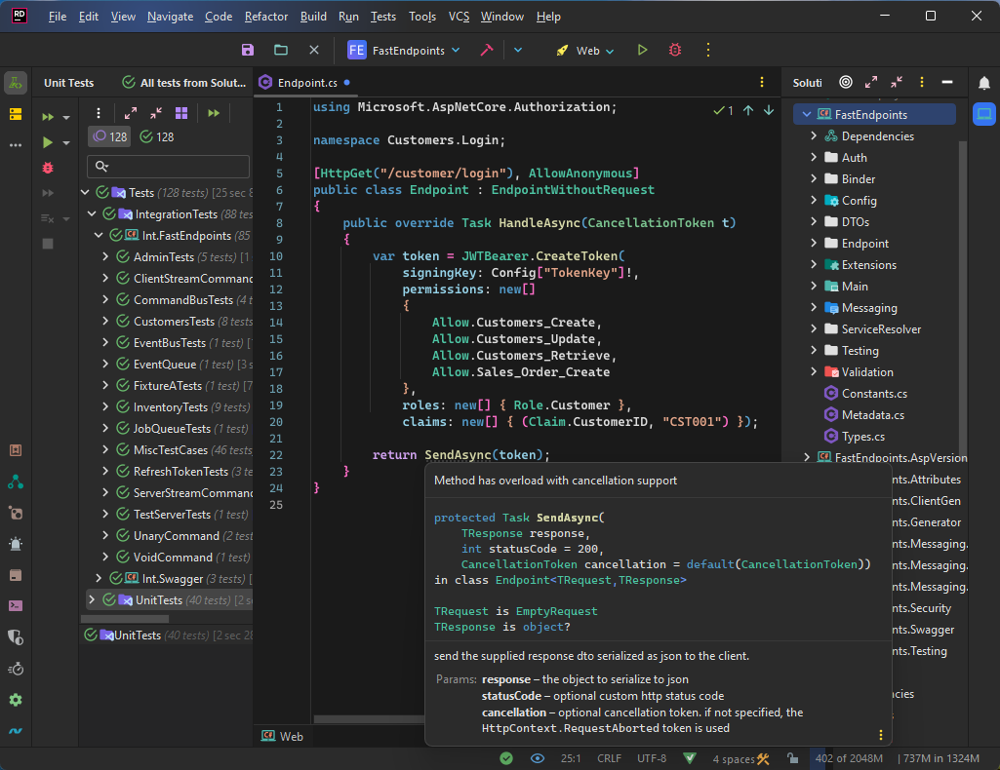

# Rider-Settings-For-VS-Users

This repository contains JetBrains Rider IDE configuration files that tries to bring a Visual Studio like experience to Rider in order to help long term VS users' transition to Rider a bit less painful.

## How to use the settings

**Note:** Do not use the import/export settings wizard in Rider, as it only does a subset of the configuration.

1. Find the directory on your harddrive where Rider stores it's config files. Typically in Windows, it's located in the following location: `%AppData%\JetBrains\Rider2023.x\`

2. Backup all the files and folders in the above location, in case you want to revert back to your existing configuration.

3. After backing up the files, delete everything in the `Rider2023.x` folder.

4. Copy everything from this repository's [Rider2023.x](/Rider2023.x) folder to your local folder.

5. Launch Rider and go through the license activation process. That's it!

## Commonly used keyboard shortcuts

The keymap has been customized to suit my personal needs. You may want to change them to fit what you're used to from Visual Studio.

- Close current solution (open welcome screen): `CTRL + ALT + X`
- Settings window: `CTRL + Q`
- Find usages of a symbol: `CTRL + /`
- Jump to definition/source: `CTRL + .`
- Navigate back: `CTRL + ,`
- Expand all: `CTRL + "`
- Collapse to definitions: `CTRL + ;`
- Collapse only doc/xml comments: `CTRL + L`
- Toggle line comment: `CTRL + ALT + C`
- Move selected definition to separate file: `CTRL + M`
- Run project: `F5`
- Debug project: `CTRL + F5`
- Run tests in current session: `CTRL + R`
- Close current tab: `CTRL + F4`
- Close other tabs except current: `CTRL + \`
- Close all tabs: `CTRL + Backspace`
- Show file structure/outline: `CTRL + O`
- Show unit tests: `CTRL + P`
- Show contextual actions: `CTRL + Enter`
- Apply hot reload changes: `F12`
- Create new file/folder menu: `CTRL + N`
- Surround selection with live template: `CTRL + Shift + S`
- Save file with clean & reformat: `CTRL + S`

## Disabled plugins

Some plugins such as git, docker & front-end dev related plugins are disabled. You can easily enable them from the plugin settings if you need them.